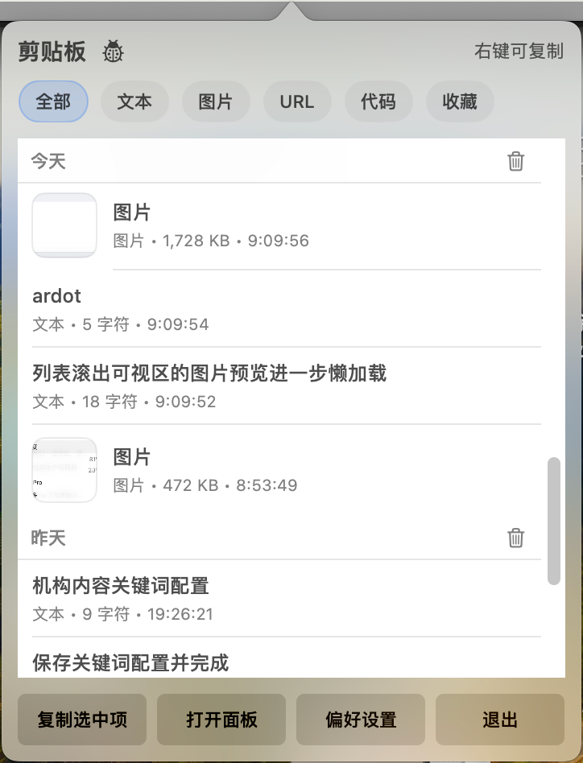
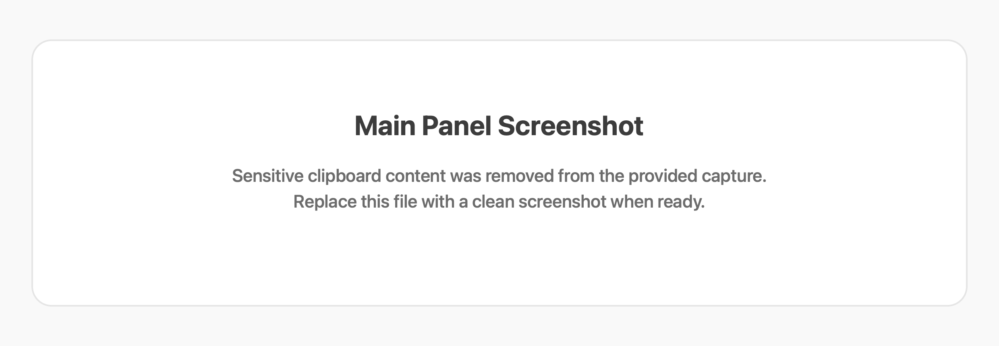
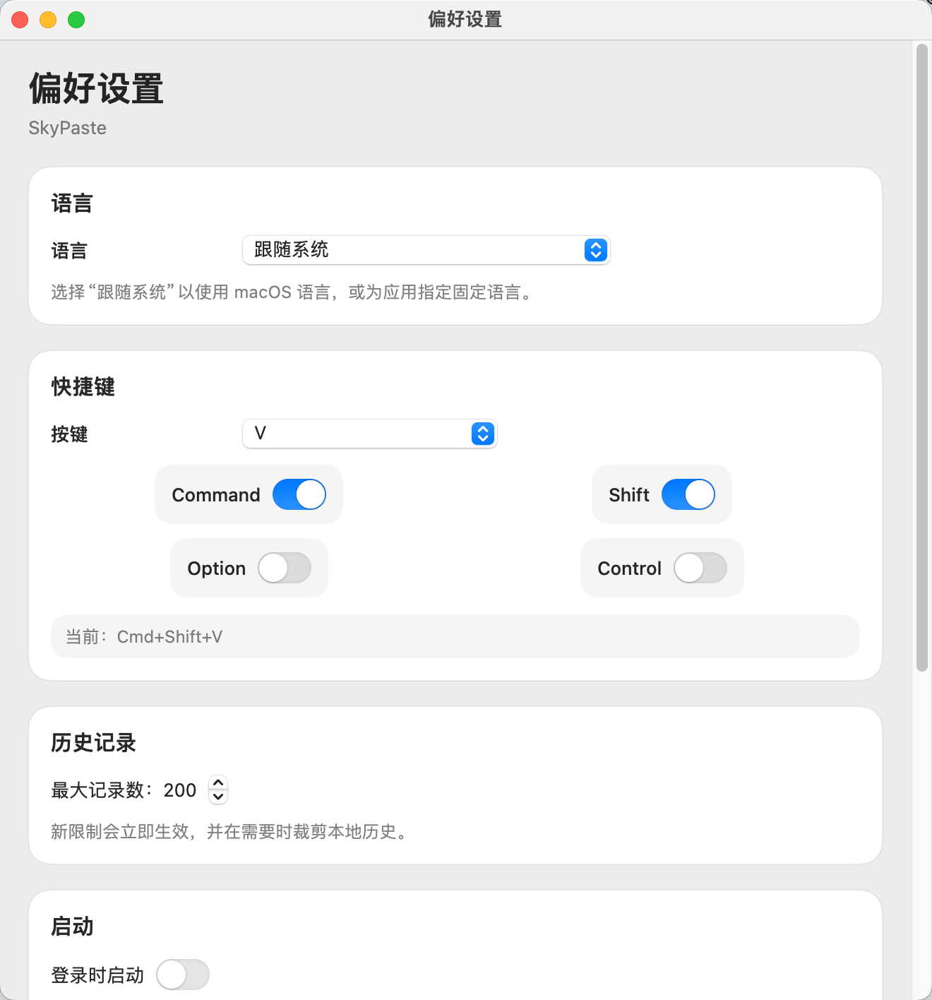

# SkyPaste

<p align="center">
  
</p>

<p align="center">
  <strong>简洁的剪切板内容管理工具</strong>
</p>
<p align="center">
  <strong>A simple clipboard content manager</strong>
</p>

<p align="center">[中文](#中文) | English</p>

SkyPaste is a simple macOS clipboard manager for text, images, and file URLs, designed for fast menu bar access, searchable history, filters, favorites, and keyboard-driven workflows.

## Screenshots

### Menu Bar Popover



### Main Panel



### Preferences



## Features

- Clipboard history for text, images, and file URLs
- Menu bar popover for quick access
- Searchable main panel
- Filters: All, Text, Image, URL, Code, Favorites
- Day-based grouped history sections
- Favorites with pinned display at the top
- Delete a single item or delete all items from a specific day
- Single-click to select, right-click to copy / favorite / delete
- `Cmd+C` to copy the currently selected item
- `Enter` to paste the currently selected item
- `Cmd+1...9` to quick-paste the first 9 items
- Customizable global hotkey to open the panel
- Local SQLite persistence
- Multi-language support: English, Simplified Chinese, Traditional Chinese, Japanese, Korean, French
- Memory optimizations for image history:
  - thumbnails are kept in memory instead of full-size images
  - image previews are lazily loaded only when rows are visible
  - full-resolution images stay in the local database and are restored on demand when copying

## Current Status

SkyPaste is already usable as a practical daily menu bar clipboard utility, with the core workflow in place:

- quick menu bar access
- clipboard history browsing and search
- favorites and category filters
- local persistence
- paste-back into the previous app

## Local Storage

Clipboard history is stored locally in SQLite:

```text
~/Library/Application Support/SkyPaste/history.sqlite
```

## Open in Xcode

The repo now uses the Xcode project in `skypaste.xcodeproj`.

```text
open skypaste.xcodeproj
```

From there you can run the app with `Product -> Run`, or archive it with `Product -> Archive`.

For App Store submission, use Xcode's archive/distribution flow and App Store Connect.

## Release Process

See [docs/RELEASING.md](docs/RELEASING.md) for the Xcode release checklist and versioning flow.

## App Store Preparation

See [docs/APP_STORE.md](docs/APP_STORE.md) for the sandbox, signing, and App Store submission checklist.

## Preferences

Open `Preferences` from the menu bar app to configure:

- app language
- global hotkey
- history limit
- launch at login
- ignored apps list (bundle IDs)

## Permissions

To support automatic paste back into the previous app, macOS may request Accessibility permission:

- `System Settings` -> `Privacy & Security` -> `Accessibility`
- enable the terminal or the packaged app running SkyPaste

## Notes

- No cloud sync in the current version
- No tag system or end-to-end encryption yet
- Data is stored locally by default
- The old SwiftPM packaging scripts were removed in favor of the Xcode project
- License: [MIT](LICENSE)

---

## 中文

<p align="center">
  <strong>简洁的剪切板内容管理工具</strong>
</p>

<p align="center">
  <strong>A simple clipboard content manager</strong>
</p>

SkyPaste 是一个 macOS 剪贴板管理工具，支持文本、图片、文件地址的历史记录、快速检索、菜单栏操作和快捷键调用。

### 截图

- 菜单栏弹窗  
  
- 主面板（敏感内容已移除）  
  
- 偏好设置  
  

### 功能特性

- 监听并保存剪贴板历史：文本、图片、文件 URL
- 菜单栏弹窗查看历史记录
- 主面板搜索与筛选
- 分类筛选：全部、文本、图片、URL、代码、收藏
- 按天分组显示历史记录
- 收藏功能，支持置顶显示
- 支持删除单条记录和删除某一天的全部记录
- 单击选中，右键菜单复制/收藏/删除
- `Cmd+C` 复制当前选中项
- `Enter` 粘贴当前选中项
- `Cmd+1...9` 快速粘贴前 9 条
- 全局快捷键呼出面板，可在设置中自定义
- 本地 SQLite 持久化存储
- 多语言支持：English、简体中文、繁体中文、日本語、한국어、Français
- 图片历史做了内存优化：
  - 内存中优先保留缩略图
  - 列表滚动时图片预览按可视区域懒加载
  - 原图仍保存在本地数据库中，复制时按需恢复

### 项目状态

当前版本已经可以作为日常可用的菜单栏剪贴板工具使用，重点能力已经完整：

- 菜单栏快速查看与复制
- 剪贴板历史检索
- 收藏与分类管理
- 本地持久化
- 自动粘贴回原应用

### 本地数据位置

SkyPaste 使用本地 SQLite 数据库存储历史记录：

```text
~/Library/Application Support/SkyPaste/history.sqlite
```

### 在 Xcode 中打开

仓库现在以 `skypaste.xcodeproj` 为主工程。

```text
open skypaste.xcodeproj
```

然后可以直接在 Xcode 中使用 `Product -> Run` 运行，或使用 `Product -> Archive` 打包。

如果要上架 App Store，请使用 Xcode 的归档和发布流程，再到 App Store Connect 提交。

### 偏好设置

可在菜单栏中打开 `偏好设置`，支持配置：

- 应用语言
- 全局快捷键
- 历史记录上限
- 登录时启动
- 忽略应用列表（按 bundle id）

### 系统权限

如果你需要“复制后自动粘贴回原应用”，macOS 可能会要求辅助功能权限：

- `系统设置` -> `隐私与安全性` -> `辅助功能`
- 勾选运行 SkyPaste 的终端或打包后的 App

### 说明

- 当前版本不包含云同步
- 当前版本不包含标签系统和端到端加密
- 数据默认仅保存在本地设备
- 旧的 SwiftPM 打包脚本已移除，仓库以 Xcode 工程为主
- 协议： [MIT](LICENSE)
