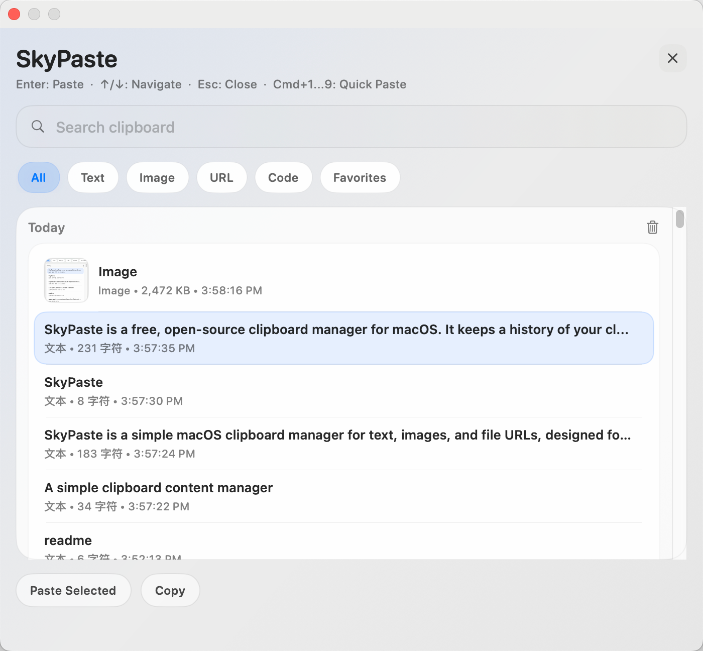
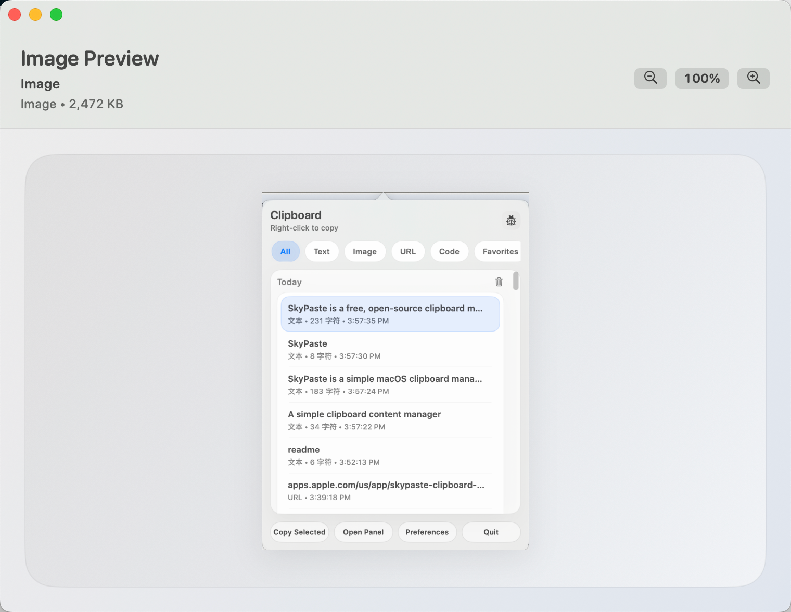
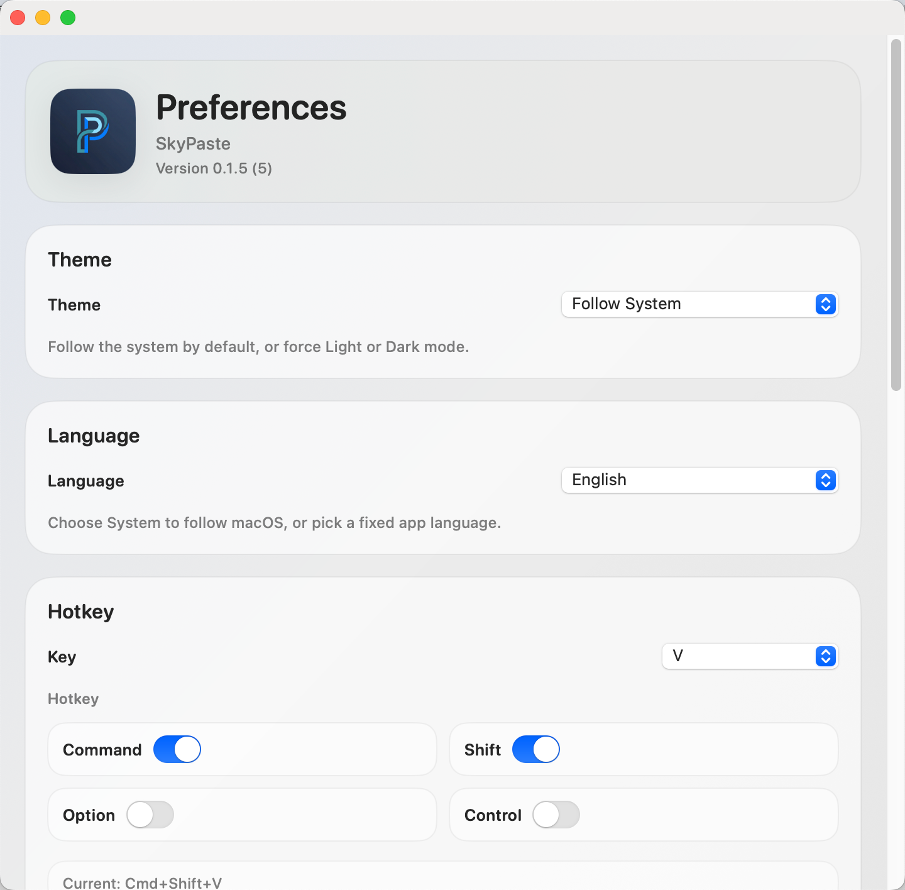
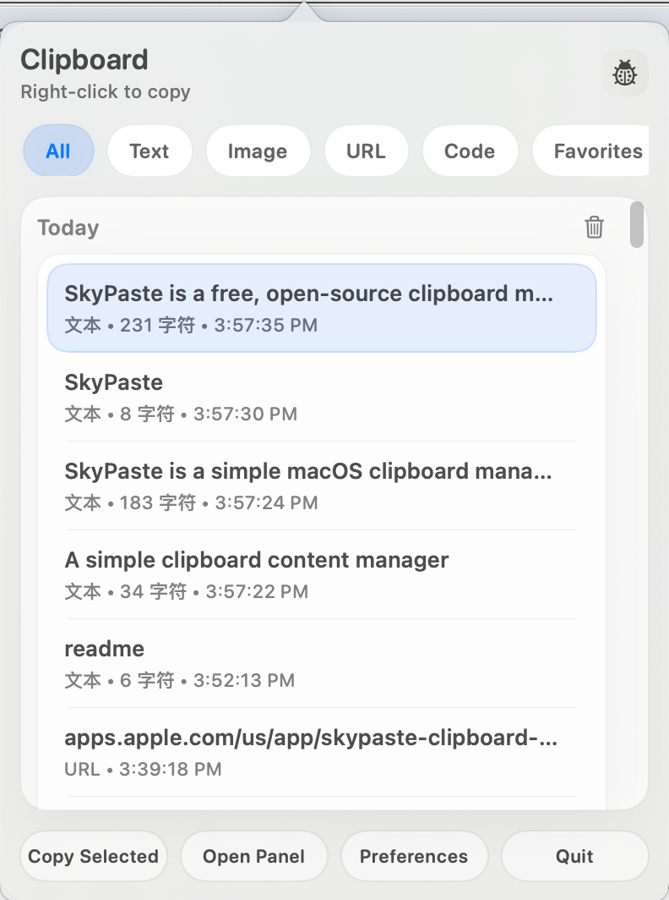

# SkyPaste - macOS 剪贴板管理器，支持历史记录、搜索、同步、文件和图片

<p align="center">
  
</p>

<p align="center">
  <strong>轻量、高效、好用的 macOS 剪贴板历史管理工具。</strong><br>
  保存、搜索、预览、分类管理并同步文本、链接、图片、文件、目录、代码和邮箱地址。
</p>

<p align="center">
  中文 | <a href="README.md">English</a>
</p>

<p align="center">
  <a href="https://apps.apple.com/us/app/skypaste-clipboard-manager/id6760884520?mt=12">在 Mac App Store 下载</a>
</p>

SkyPaste 是一款专为 macOS 打造的剪贴板管理器，适合每天高频复制粘贴的用户。它可以记录剪贴板历史，快速搜索历史内容，按类型清晰分类，通过菜单栏快速访问，并支持通过 iCloud 同步 SkyPaste 剪贴板内容。

## 搜索关键词

macOS 剪贴板管理器、剪贴板历史、剪贴板搜索、剪贴板同步、iCloud 剪贴板、菜单栏剪贴板工具、复制粘贴工具、粘贴管理器、图片剪贴板、文件剪贴板、目录剪贴板、URL 历史、邮箱剪贴板、Mac 效率工具。

## 最新更新

- 新增邮箱分类，复制邮箱地址后可以单独筛选。
- 优化菜单栏列表和主面板列表性能。
- 优化系统分享弹窗位置，让分享内容和选中 item 的关联更清晰。
- 优化 URL、邮箱、代码内容的识别准确性。
- 优化列表滚动到顶部和底部时的显示稳定性。
- 拆分筛选、图片加载和系统分享相关代码，降低耦合。

## 截图

### 菜单栏剪贴板历史



### 主面板



### 偏好设置



### 概览



## 功能特性

- 记录文本、链接、图片、文件、目录、代码和邮箱地址等剪贴板历史。
- 菜单栏弹窗快速查看和复制历史内容。
- 主面板支持搜索、分类筛选、来源应用筛选和按天分组。
- 分类支持：全部、文本、图片、文件、目录、代码、URL、邮箱、收藏。
- 邮箱识别，支持独立邮箱分类和发送邮件操作。
- URL 识别，支持浏览器打开。
- 文件和目录识别，支持详情预览、复制路径、在 Finder 中显示和打开。
- 图片预览支持缩放和拖动查看。
- 收藏内容不会因为普通历史上限被清理，除非用户主动取消收藏。
- 支持批量选择、批量删除和批量收藏。
- 本地复制内容支持显示来源应用标识。
- 支持 iCloud 同步 SkyPaste 剪贴板内容。
- 支持同一 Apple 账户下 iPhone 到 Mac 的复制内容同步。
- 支持隐私内容过滤开关，尽量忽略敏感剪贴板文本。
- 支持按应用名称或 bundle ID 忽略指定应用。
- 支持自定义全局快捷键。
- 支持 `Cmd+C`、`Enter`、`Cmd+1...9` 等快捷操作。
- 支持跟随系统、浅色模式和深色模式。
- 内置多语言：英文、简体中文、繁体中文、日语、韩语、法语。
- 本地 SQLite 持久化存储。
- 图片历史做了内存优化，列表懒加载缩略图，复制时按需恢复原图。

## 本地数据位置

SkyPaste 使用本地 SQLite 数据库存储剪贴板历史：

```text
~/Library/Application Support/SkyPaste/history.sqlite
```

数据默认保存在本机。iCloud 同步为可选功能，可在偏好设置中开启。

## 在 Xcode 中打开

SkyPaste 使用 `skypaste.xcodeproj` 作为主工程。

```text
open skypaste.xcodeproj
```

可以通过 `Product -> Run` 运行，或通过 `Product -> Archive` 打包。

如需提交 App Store，请使用 Xcode 归档流程和 App Store Connect。

## 发布与上架文档

- 发布清单：[docs/RELEASING.md](docs/RELEASING.md)
- App Store 清单：[docs/APP_STORE.md](docs/APP_STORE.md)
- 元数据清单：[docs/APP_STORE_CHECKLIST.md](docs/APP_STORE_CHECKLIST.md)
- 隐私政策模板：[docs/PRIVACY_POLICY.md](docs/PRIVACY_POLICY.md)

## 系统权限

如果需要支持自动粘贴回前台应用，macOS 可能会请求辅助功能权限：

```text
系统设置 -> 隐私与安全性 -> 辅助功能
```

请勾选打包后的 SkyPaste App，或开发运行时使用的终端/Xcode。

## 协议

[MIT](LICENSE)
