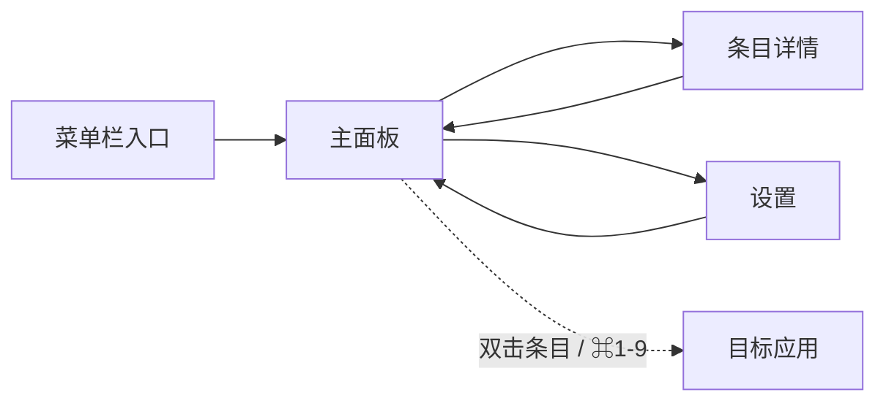

> 🤖 **AI 推断**：页面清单与跳转关系由 AI 根据需求文档推断，与原型页一起评审确认。

## 标注阅读说明

每个线框页由两部分组成：**左侧线框窗口**（灰阶占位，只表达结构与交互）+ **右侧标注栏**（交互与规则的说明）。

### 重要程度与颜色

| 颜色 | 级别 | 语义 | 典型用途 |
|---|---|---|---|
| 🔴 红 | crit | 核心 / 必须 | 核心交互路径、P0 功能行为 |
| 🟡 黄 | warn | 待确认 / 注意 | 策略待评审、边界场景、风险点 |
| 🔵 蓝 | info | 一般说明 | 常规功能说明、交互细节 |
| 🟢 绿 | ok | 参考信息 | 状态栏、辅助信息、布局说明 |

### 如何读图

1. 目标元素上有**带序号的圆形徽章**——颜色代表重要程度，序号是标注编号
2. 徽章通过**虚线**连接到右侧标注栏中**同序号**的标注框
3. 序号顺序 = 目标位置从上到下的顺序，标注栏同样从上到下排列，连线互不交叉

### 其他约定

- 左侧菜单中线框页带 `01 ·` 格式序号，与页面顺序一致，便于口头引用（"看 02 号原型"）
- 线框为低保真：不表达视觉样式、配色与最终布局尺寸；**颜色仅用于标注分级**
- 每页标注 3~5 个，按重要程度选择，避免信息过载

## 页面清单

| 页面 | 入口 | 职责 | 对应需求 |
|---|---|---|---|
| 主面板 | 快捷键 / 菜单栏 | 历史列表、搜索筛选、预览与快捷操作 | FR-201 ~ FR-205 |
| 条目详情 | 主面板「详情」 | 单条内容完整信息与操作 | FR-205、FR-206 |
| 设置 | 菜单栏 | 通用 / 快捷键 / 忽略规则 / 存储 | FR-104、FR-301 |

## 跳转关系

## 设计说明

- 主面板为唯一高频界面，搜索框常驻顶部，数字键序号固定在列表左侧
- 详情与设置均为独立窗口，关闭后回到主面板
- 移动场景暂不考虑（macOS 桌面端产品）
