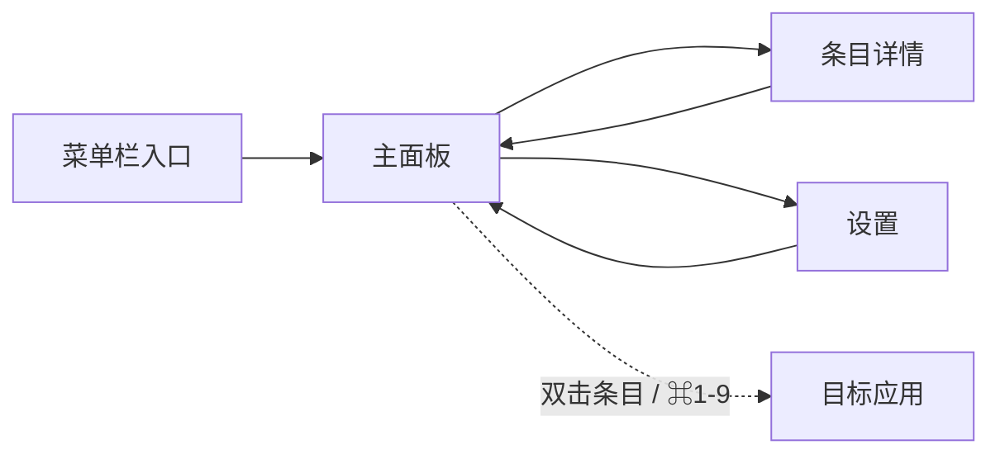

> 🤖 **AI 推断**：页面清单与跳转关系由 AI 根据需求文档推断，与原型页一起评审确认。

## 页面清单

| 页面 | 入口 | 职责 | 对应需求 |
|---|---|---|---|
| 主面板 | 快捷键 / 菜单栏 | 历史列表、搜索筛选、预览与快捷操作 | FR-201 ~ FR-205 |
| 条目详情 | 主面板「详情」 | 单条内容完整信息与操作 | FR-205、FR-206 |
| 设置 | 菜单栏 | 通用 / 快捷键 / 忽略规则 / 存储 | FR-104、FR-301 |

## 跳转关系

## 设计说明

- 主面板为唯一高频界面，搜索框常驻顶部，数字键序号固定在列表左侧
- 详情与设置均为独立窗口，关闭后回到主面板
- 移动场景暂不考虑（macOS 桌面端产品）
