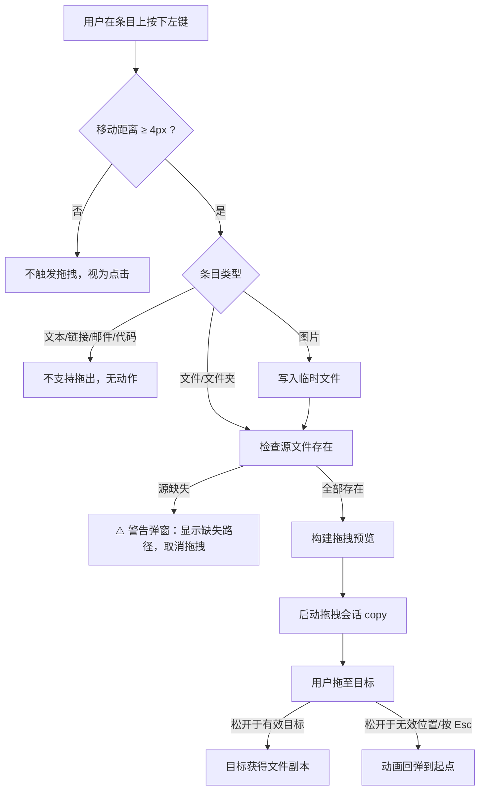

> 📌 **溯源说明**：本页内容提取自 SkyPaste 0.2.7 真实实现（`SkyClipboardRowDragSupport.swift`），描述的是已上线行为，对应 FR-205。

## 功能定义

用户可将历史列表中的**图片**与**文件**条目直接拖拽到外部目标（Finder、聊天窗口、浏览器上传框等），无需先落盘再发送。拖拽语义为**复制**（copy），不影响 SkyPaste 内的原始条目。

## 交互流程

## 支持范围

| 条目类型 | 支持拖出 | 拖出内容 |
|---|---|---|
| 图片（PNG/JPEG/TIFF） | ✅ | 临时文件，保留原始编码与扩展名 |
| 图片（其他格式） | ✅ | 转换为 PNG 临时文件 |
| 文件（单/多个） | ✅ | 原文件引用（不复制不移动源文件） |
| 文件夹 | ✅ | 原目录引用 |
| 文本 / 链接 / 邮件 / 代码 | ❌ | 明确不支持（仅图片与文件可拖） |

## 行为细节

| 行为 | 规格 |
|---|---|
| 误触阈值 | 按下后位移 ≥ 4pt 才启动拖拽，避免与单击选中冲突 |
| 拖拽语义 | copy（忽略 ⌘/⌥ 等修饰键，恒为复制） |
| 预览样式 | Finder 风格：56pt 图标对角堆叠，最多显示 3 个 |
| 多文件角标 | 首图标右下角圆形数量角标（系统强调色） |
| 图片缩略图 | 图片文件用圆角缩略图替代通用文件图标 |
| 预览锚点 | 锚定光标实时位置（会话启动可能滞后于按下时刻） |
| 取消反馈 | 取消/失败时预览动画回弹到起始位置 |
| 右键 / 抬手 | 取消待定拖拽，不启动会话 |

## 图片临时文件机制

- 位置：系统临时目录下 `SkyPasteDragItems/`
- 命名：`清洗后的原文件名-条目UUID.扩展名`
- 写入策略：PNG/JPEG/TIFF **原始字节原样写入**（避免主线程重编码大图拖慢会话启动）；未识别格式转 PNG
- 同尺寸跳过：目标文件已存在且大小一致时不重写
- 清理：**48 小时过期**，每次新拖拽时顺带清理过期文件

## 异常与边界

| 场景 | 行为 |
|---|---|
| 源文件已被移动/删除 | 启动前检测，弹警告窗（区分文件/文件夹文案，显示完整路径），取消拖拽 |
| 临时目录创建失败 / 图片转换失败 | 静默取消拖拽，不崩溃 |
| 多文件条目部分缺失 | 第一个缺失项即中止并警告 |
| 拖到 SkyPaste 自身窗口 | 系统按无效目标处理，动画回弹 |
| 大图片（如 50MB TIFF） | 原始字节直写，无明显延迟；仅未识别格式才转码 |
| 文本类条目按住拖动 | 无任何反应（不支持即无反馈） |

## 埋点关联

对应事件 `drag_out`（见上线目标 → 数据埋点）：按条目类型细分（image/file/folder），用于评估该功能使用率与目标类型分布。

## 版本历史

| 版本 | 变更 |
|---|---|
| 0.2.7 | 功能上线：图片与文件拖出、拖拽分类修复 |

> 🤖 **AI 推断**：浏览器网页内上传框（如网盘页面）的拖放兼容性未见实现细节，建议补充实测用例（对应 US-04 待确认项）。
